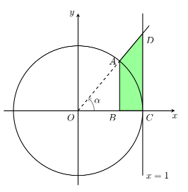

## Considera o círculo trigonométrico e um trapézio [ABCD] onde, o ponto A é um ponto móvel e movimenta-se ao longo do primeiro quadrante, O ponto B pertence ao eixo das abcissas e acompanha A de modo que $[AB] \perp Oy$, D é o ponto de interseção de OA com x = 1 e $\alpha \in ]0;\dfrac{\pi}{2}[$
## Qual é o valor  do trapézio em função de $\alpha$,?

A) $\large{\dfrac{\tan{\alpha}-\sin{\alpha}\cos{\alpha}}{2}}$

B) $\large{\dfrac{\sin{\alpha}-\sin{\alpha}\cos{\alpha}}{2}}$

C) $\large{\dfrac{\cos{\alpha}-\sin{\alpha}\cos{\alpha}}{4}}$

D) $\large{\dfrac{\sin{\alpha}-\sin{\alpha}\cos{\alpha}}{4}}$
